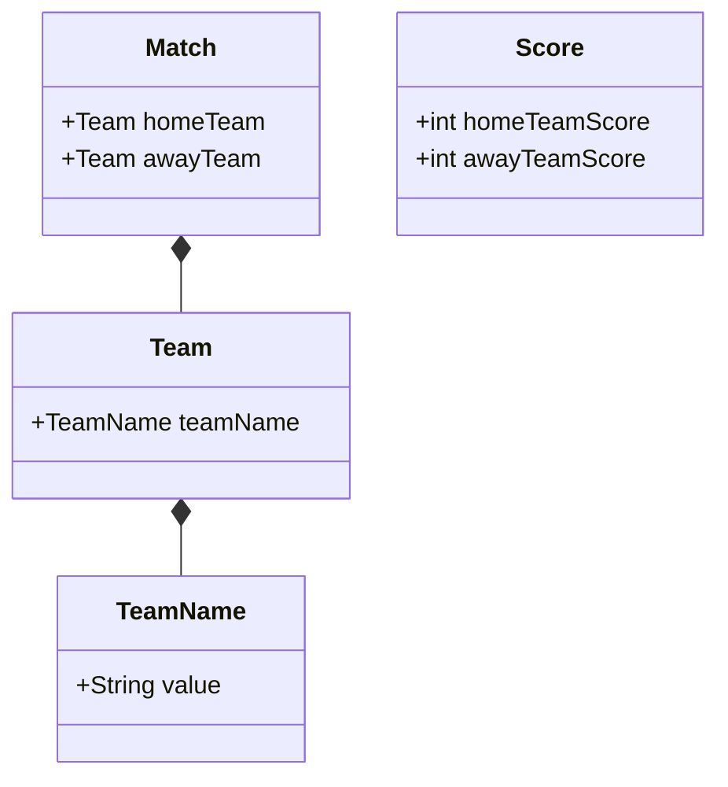

# scoreboard-library
Live Football World Cup Scoreboard

How to build
* `./gradlew clean build`
N.B. jdk 17 is required

Structure
The main interface is `Scoreboard`, which defines 4 methods  for interacting with the library which were mentioned in the requirements document. 
Respectively, the `ScoreboardImpl` is its only implementation.
Another important interface is `ScoreboardStorage` which defines contract for storage of matches/scores. It defines 5 basic operations which somewhat resemble `java.util.Map`'s interface 
The `SimpleScoreboardStorage` is a naive implementation if that interface which is utilising Java's `LinkedHashMap` for storing `Match` vs `Score` mappings. 
`ScoreboardImpl` depends on `ScoreboardStorage` to store matches information.
* The domain model looks like following

The model itself is subject to extension/modification, since for the scope of this assignment some simplifications were made.
For instance, `Score` would typically be a part of `Match`, not a standalone entity (this was done in order to simplify storage structure, since `Score` is not what `Match` identity should rely on)
Apart from this, `Team` currently has the only field of `TeamName` however I'd expect that there could be much more information apart from it

Implementation considerations
* Current implementation does not validate team names, I think, production-ready library would require some validation (e.g. don't allow non-existing country, total amount of countries, etc)
* When updating score, in my opinion it would make sense to throw an exception if the new score for any team is lower than the existing (I'm not a football expert, but I never saw this happening during the game). 
Also it might make sense to only allow incrementing score (i.e. only allow to increase by 1), but I decided to leave it out as I was not 100% sure if it would bring any value
* The logic for determining which match was started earlier relies on the order of insertion of `Match` objects in the underlying data structure (I chose `LinkedHashMap` exactly because of this)
However for real-life scenarios I think I'd base this on a timestamp (ideally the `Match` class should have the information about when it started), since this is generally more standard and reliable approach (insertion order approach seemed to be more simple to implement here)
* Storing `Match`, `Team` and `Score` as Java record makes sense here, as in the scope of this task it's ok to treat those as DTO's as we don't have exact requirements on how to store them. Apparently, the production-ready library should support storing them in some database, 
hence it would require describing corresponding entities for them.
* Some methods like `Scoreboard.updateScore` or `Scoreboard.finishMatch` could declare that they may throw exception. I decided not to complicate it, hence used standard unchecked exception like `IllegalStateException` or `NullPointerException` without declaring them. However it may be a good idea to have custom exception for situations like these.